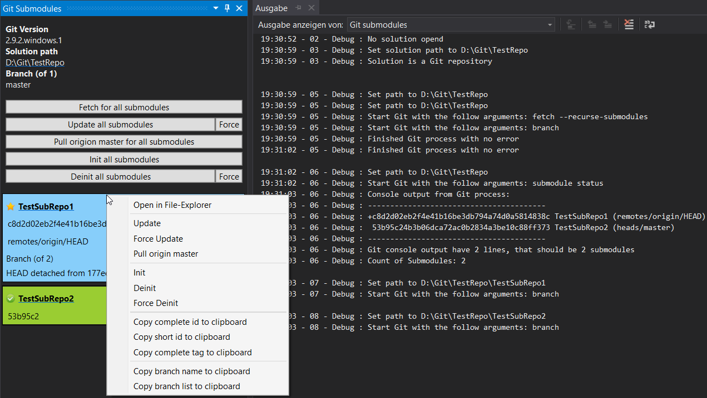
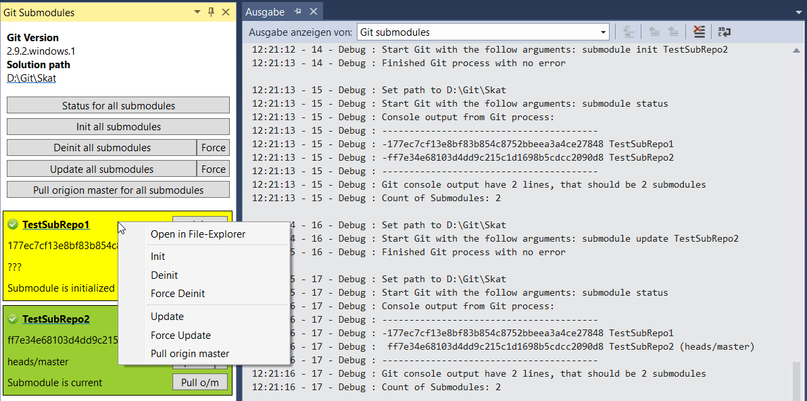
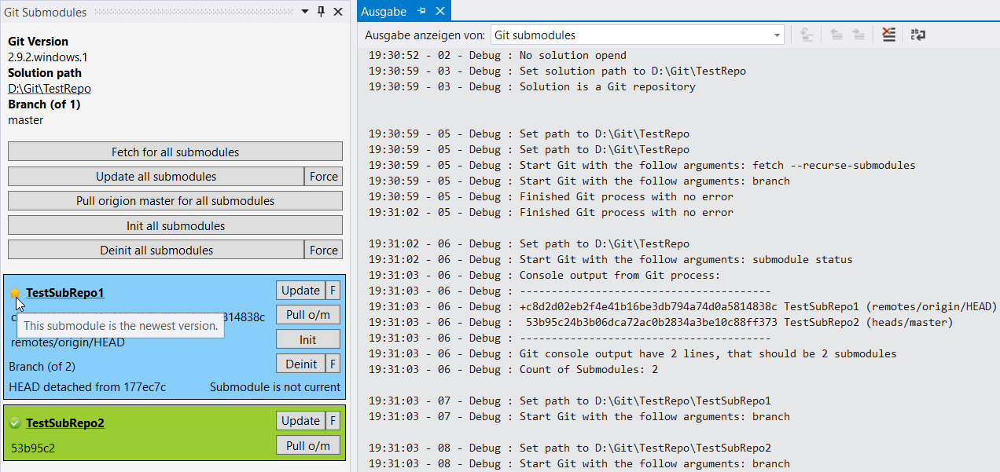

# Git Submodules

## Info
This Visual Studio extension is for users that need a easier way to handle with Git submodules inside Visual Studio.

## System requirements
* Visual Studio 2010, 2012, 2013, 2015
* [.NET Framework 4.5](https://www.microsoft.com/de-de/download/details.aspx?id=30653)
* [Git for Windows](https://git-for-windows.github.io/)

## How to
1. Download from [Visual Studio extension site](https://visualstudiogallery.msdn.microsoft.com/0e71baf2-2d0b-44f9-8172-d27df583ad20) or over Visual Studio extension manager ([or direct](https://github.com/Dark-Water/GitSubModulesVsPlugin/tree/master/VSIX%20for%20Testers))
2. Install VSIX 
3. Restart Visual Studio
4. Menu -> View -> Other Windows -> Git Submodules

## For Visual Studio 2010 users
* The tool window is automatic close on visual studio 2010 shutdown
* It's currently not possible to restore the window on startup without a partial crash inside visual studio 2010
* When you know about this problem and you have a solution, please write me

## Whats next?
* [See milestones inside bugtracker](https://github.com/Dark-Water/GitSubModulesVsPlugin/milestones)

## Supported Git functions for each and all submodules
* Fetch
* Init
* Deinit (Force)
* Update (Force)
* Pull origin master

## Shown information
* Git version
* Path to the current open solution
 * Left-click for open in File-Explorer
* Submodules of this repository
 * Status of the last action
 * Name of the Submodule
   * Left-click for open in File-Explorer
 * Id (SHA-1) of the submodule
   * Right-click menu for copy to clipboard
    * or use CTRL+C to copy to clipboard
 * Last Tag of the submodule
   * Right-click menu for copy to clipboard
    * or use CTRL+C to copy to clipboard
 * Status of the submodule

## Right-click options for a submodule
* Open in File-Explorer
* Init
* Deinit (Force)
* Update (Force)
* Pull origin master
* Copy id to clipboard
* Copy tag to clipboard
 
## Others
* Supported any used Visual Studio theme
* Automatic fetch submodule status from server on first open of a soultion
* Debug and error messages will be written on a separate output window
* The output window is automatical actiavte on the first use and when a error occures

## Pictures
On dark theme

On blue theme

On light theme

## Submodule status colours
| Submodule status               | Colour           |
| ------------------------------ | ---------------- |
| Unknown Status (Please Report) | LightGray        |
| Submodule is not initialized   | LightCoral (Red) |
| Submodule is initialized       | Yellow           |
| Submodule has merge conflicts  | DarkOrange       |
| Submodule is current           | YellowGreen      |
| Submodule is not current       | LightSkyBlue     |

## Test matrix
| Visual Studio | Community / Express        | Professional   | Premium        | Ultimate / Enterprise |
|-------------- | -------------------------- | -------------- | -------------- | --------------------- |
| 2010          | ???                        | on testing     | Should be work | **tested**            |
| 2012          | *Extensions not supported* | **tested**     | Should be work | Should be work        |
| 2013          | ???                        | **tested**     | Should be work | **tested**            |
| 2015          | **tested**                 | **tested**     | -              | Should be work        |

## Copyrights and Copylefts
* Indicator Icons
 * Found: Via IconFinder 
 * Licence: Free for commercial use
 * Autor: Andy Gogena
 * Website: http://www.graphicrating.com/
 * Changes: Reduced image dimensions
* Git Logo 
 * Found: On Git website -> Orange logomark for light backgrounds
 * Licence: [Creative Commons Attribution 3.0 Unported License](https://creativecommons.org/licenses/by/3.0/)
 * Auto: Jason Long
 * Website: https://git-scm.com/downloads/logos
 * Changes: Reduced image dimensions
